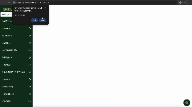

# [SKKU Building](https://github.com/ShinYoung-hwan/SKKU-Buildings)

## INTRO

- Get directions from current location to a specific Sungkyunkwan University building!

  

## How to start

- Click [Here](https://shinyoung-hwan.github.io/SKKU-Buildings/)!
- Allow GPS permissions

## Tech reference

- html + css + js
- Map API: **Kakao Maps API**
- Periodically update building informations via **Github Action**
- Mobile App: Flutter
